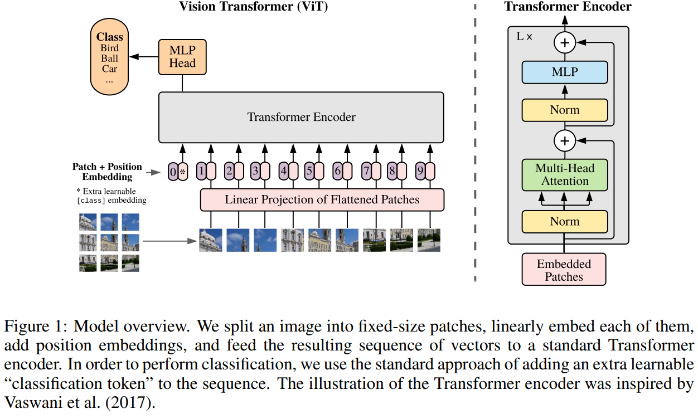

## Materials

[Open notebook in Colab](https://colab.research.google.com/gist/fercer/d4757f8257607cb0748c65714660600b/advanced_machine_learning_with_python_session_1_2.ipynb){.btn .btn-outline-primary .btn role="button" target=”_blank”} [View solutions](https://colab.research.google.com/gist/fercer/d4757f8257607cb0748c65714660600b/advanced_machine_learning_with_python_session_1_2-solved.ipynb){.btn .btn-outline-primary .btn role="button" target=”_blank”}


# **C**onvolutional **N**eural **N**etwork (**CNN** or **ConvNet**)

---

## Convolution layers

The most common operation in DL models for image processing are Convolution operations.


The animation shows the convolution of a 7x7 pixels input image (bottom) with a 3x3 pixels kernel (moving window), that results in a 5x5 pixels output (top).

---

## Exercise: Visualize the effect of the convolution operation

- [ ] Create a convolution layer with `nn.Conv2D` using 3 channels as input, and a single one for output.

``` {python}
#| echo: false
# @title Load CIFAR-100 dataset and split into training, validation, and test subsets
import torch
from torch.utils.data import random_split, DataLoader

import torchvision
from torchvision.transforms.v2 import Compose, PILToTensor, ToDtype

pre_process = Compose([
  PILToTensor(),
  ToDtype(torch.float32, scale=True)
])

cifar_ds = torchvision.datasets.CIFAR100(root="/tmp", train=True, download=True, transform=pre_process)
cifar_train_ds, cifar_val_ds = random_split(cifar_ds, (40_000, 10_000))

cifar_test_ds = torchvision.datasets.CIFAR100(root="/tmp", train=False, download=True, transform=pre_process)


cifar_train_dl = DataLoader(cifar_train_ds, batch_size=128, shuffle=True)
cifar_val_dl = DataLoader(cifar_val_ds, batch_size=256)
cifar_test_dl = DataLoader(cifar_test_ds, batch_size=256)
```

``` {python}
import torch.nn as nn

conv_1 = nn.Conv2d(in_channels=3, out_channels=1, kernel_size=7, padding=0, bias=True)

x, _ = next(iter(cifar_train_dl))

fx = conv_1(x)
```

``` {python}
print("Input:", type(x), x.dtype, x.shape, x.min(), x.max())
print("Output:", type(fx), fx.dtype, fx.shape, fx.min(), fx.max())
```

::: {.callout-warning}
The convolution layer is initialized with random values, so the results will vary.
:::

---

## Exercise: Visualize the effect of the convolution operation

- [ ] Create a convolution layer with `nn.Conv2D` using 3 channels as input, and a single one for output.

``` {python}
import matplotlib.pyplot as plt

plt.rcParams['figure.figsize'] = [5, 5]

fig, ax = plt.subplots(1, 2)
ax[0].imshow(x[0].permute(1, 2, 0))
ax[1].imshow(fx.detach()[0, 0], cmap="gray")
plt.show()
```

::: {.callout-important}
By default, outputs from PyTorch modules are tracked for back-propagation.

To visualize it with `matplotlib` we have to `.detach()` the tensor first.
:::

---

## Exercise: Visualize the effect of the convolution operation

- [ ] Visualize the weights of the convolution layer.

``` {python}
conv_1.weight.shape
```

``` {python}
fig, ax = plt.subplots(2, 2)
ax[0, 0].imshow(conv_1.weight.detach()[0, 0], cmap="gray")
ax[0, 1].imshow(conv_1.weight.detach()[0, 1], cmap="gray")
ax[1, 0].imshow(conv_1.weight.detach()[0, 2], cmap="gray")
ax[1, 1].set_axis_off()
plt.show()
```

---

## Exercise: Visualize the effect of the convolution operation

- [ ] Modify the weights of the convolution layer.

``` {python}
conv_1 = nn.Conv2d(in_channels=3, out_channels=1, kernel_size=3, padding=0, bias=False)

conv_1.weight.data[:] = torch.FloatTensor([
  [
    [
      [0, 0, 0],
      [0, 0, 0],
      [0, 0, 0],
    ],
    [
      [0, 0, 0],
      [0, 1, 0],
      [0, 0, 0],
    ],
    [
      [0, 0, 0],
      [0, 0, 0],
      [0, 0, 0],
    ],
  ]
])
```

---

## Exercise: Visualize the effect of the convolution operation

- [ ] Visualize the effects after changing the values.

``` {python}
fx = conv_1(x)

fig, ax = plt.subplots(1, 2)
ax[0].imshow(x[0].permute(1, 2, 0))
ax[1].imshow(fx.detach()[0].permute(1, 2, 0))
plt.show()
```

Experiment with different values and shapes of the kernel
https://en.wikipedia.org/wiki/Kernel_(image_processing)

---

## Exercise: Visualize the effect of the convolution operation

- [ ] Modify the weights of the convolution layer.

``` {python}
conv_1 = nn.Conv2d(in_channels=3, out_channels=1, kernel_size=3, padding=0, bias=False)

conv_1.weight.data[:] = torch.FloatTensor([
  [[[0, -1, 0], [-1, 5, -1], [0, -1, 0]],
   [[0, 0, 0], [0, 0, 0], [0, 0, 0]],
   [[0, 0, 0], [0, 0, 0], [0, 0, 0]]]
])

fx = conv_1(x)

fig, ax = plt.subplots(1, 2)
ax[0].imshow(x[0].permute(1, 2, 0))
ax[1].imshow(fx.detach()[0, 0], cmap="gray")
plt.show()
```

Experiment with different values and shapes of the kernel
https://en.wikipedia.org/wiki/Kernel_(image_processing)

---

## Exercise: Visualize the effect of the convolution operation

- [ ] Modify the weights of the convolution layer.

``` {python}
conv_1 = nn.Conv2d(in_channels=3, out_channels=1, kernel_size=3, padding=0, bias=False)

conv_1.weight.data[:] = torch.FloatTensor([
  [[[1, 0, -1], [1, 0, -1], [1, 0, -1]],
   [[1, 0, -1], [1, 0, -1], [1, 0, -1]],
   [[1, 0, -1], [1, 0, -1], [1, 0, -1]]]
])

fx = conv_1(x)

fig, ax = plt.subplots(1, 2)
ax[0].imshow(x[0].permute(1, 2, 0))
ax[1].imshow(fx.detach()[0, 0], cmap="gray")
plt.show()
```

Experiment with different values and shapes of the kernel
https://en.wikipedia.org/wiki/Kernel_(image_processing)

---

## Examples of popular Deep Learning models in computer vision

* Residual Neural Networks


---

## Examples of popular Deep Learning models in computer vision

* Inception (v3)


---

## Examples of popular Deep Learning models in computer vision

* U-Net (cell segmentation)


---

## Examples of popular Deep Learning models in computer vision

* Vision Transformer (classification and segmentation)




- Segment Anything Model (SAM)
- Micro-SAM


---

## Examples of popular Deep Learning models in computer vision

* LeNet-5 for handwritten digits classification (<a href=http://yann.lecun.com/exdb/publis/pdf/lecun-01a.pdf>LeCun et al.</a>)


By Daniel Voigt Godoy - <a rel="nofollow" class="external free" href="https://github.com/dvgodoy/dl-visuals/">https://github.com/dvgodoy/dl-visuals/</a>, <a href="https://creativecommons.org/licenses/by/4.0" title="Creative Commons Attribution 4.0">CC BY 4.0</a>, <a href="https://commons.wikimedia.org/w/index.php?curid=150820922">Link</a>

---

## Exercise: Implement and train the LetNet-5 model with PyTorch

- [ ] Build the convolutional neural network using `nn.Sequential`, and the `nn.ReLU()` activation function.

``` {python}
lenet_clf = nn.Sequential(
    nn.Conv2d(in_channels=3, out_channels=6, kernel_size=5, bias=True),
    nn.ReLU(),
    nn.MaxPool2d(kernel_size=2),
    nn.Conv2d(in_channels=6, out_channels=16, kernel_size=5, bias=True),
    nn.ReLU(),
    nn.MaxPool2d(kernel_size=2),
    nn.Flatten(),
    nn.Linear(in_features=16*5*5, out_features=120, bias=True),
    nn.ReLU(),
    nn.Linear(in_features=120, out_features=84, bias=True),
    nn.ReLU(),
    nn.Linear(in_features=84, out_features=100, bias=True),
)
```

::: {.callout-note}
Pooling layers are used to downsample feature maps to summarize information from large regions.
:::

---

## Exercise: Implement and train the LetNet-5 model with PyTorch

- [ ] Test our implementation.

``` {python}
y_hat = lenet_clf(x)

type(y_hat), y_hat.dtype, y_hat.shape, y_hat.min(), y_hat.max()
```

---

## Exercise: Implement and train the LetNet-5 model with PyTorch {.scrollable}

- [ ] Train the model to classify images from CIFAR-100.

``` {python}
import torch.optim as optim

num_epochs = 10
train_loss = []
val_loss = []

if torch.cuda.is_available():
  lenet_clf.cuda()

optimizer = optim.SGD(lenet_clf.parameters(), lr=0.01)
loss_fun = nn.CrossEntropyLoss()

for e in range(num_epochs):
  train_loss_avg = 0
  total_train_samples = 0

  lenet_clf.train()
  for x, y in cifar_train_dl:
    optimizer.zero_grad()

    if torch.cuda.is_available():
      x = x.cuda()
    
    y_hat = lenet_clf( x ).cpu()

    loss = loss_fun(y_hat, y)

    train_loss_avg += loss.item() * len(x)
    total_train_samples += len(x)

    loss.backward()

    optimizer.step()

  train_loss_avg /= total_train_samples
  train_loss.append(train_loss_avg)

  val_loss_avg = 0
  total_val_samples = 0

  lenet_clf.eval()
  with torch.no_grad():
    for x, y in cifar_val_dl:
      if torch.cuda.is_available():
        x = x.cuda()
      
      y_hat = lenet_clf( x ).cpu()
      loss = loss_fun(y_hat, y)

      val_loss_avg += loss.item() * len(x)
      total_val_samples += len(x)

  val_loss_avg /= total_val_samples
  val_loss.append(val_loss_avg)

  print(f"[Epoch {e}] Training loss: {train_loss_avg}, validation loss: {val_loss_avg}")
```

---

## Exercise: Implement and train the LetNet-5 model with PyTorch

- [ ] Plot the average train and validation losses

``` {python}
plt.plot(train_loss, "b-", label="Average training loss")
plt.plot(val_loss, "r-", label="Average validation loss")
plt.legend()
plt.show()
```

---

## Exercise: Implement and train the LetNet-5 model with PyTorch {.scrollable}

- [ ] Compute the average accuracy for the Validation and Test sets.

``` {python}
from torchmetrics.classification import Accuracy

lenet_clf.eval()

val_acc_metric = Accuracy(task="multiclass", num_classes=100)
test_acc_metric = Accuracy(task="multiclass", num_classes=100)
train_acc_metric = Accuracy(task="multiclass", num_classes=100)

with torch.no_grad():
  for x, y in cifar_train_dl:
    if torch.cuda.is_available():
      x = x.cuda()
    y_hat = lenet_clf( x ).cpu()
    train_acc_metric(y_hat.softmax(dim=1), y)

  train_acc = train_acc_metric.compute()

  for x, y in cifar_val_dl:
    if torch.cuda.is_available():
      x = x.cuda()
    y_hat = lenet_clf( x ).cpu()
    val_acc_metric(y_hat.softmax(dim=1), y)

  val_acc = val_acc_metric.compute()

  for x, y in cifar_test_dl:
    if torch.cuda.is_available():
      x = x.cuda()
    y_hat = lenet_clf( x ).cpu()
    test_acc_metric(y_hat.softmax(dim=1), y)

  test_acc = test_acc_metric.compute()

print(f"Training acc={train_acc}")
print(f"Validation acc={val_acc}")
print(f"Test acc={test_acc}")

train_acc_metric.reset()
val_acc_metric.reset()
test_acc_metric.reset()
```
