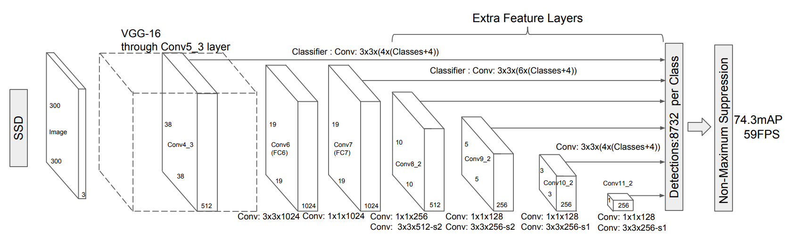

## Workshop outcomes

* Understand the process of training ML models.
*	Load pre-trained ML models and fine-tune them with new data.
*	Evaluate the performance of ML models.
*	Adapt ML models for different tasks from pre-trained models.


## Materials

[Open notebook in Colab](https://colab.research.google.com/gist/fercer/16149e05e7b2046f9d78940007fa4c2a/advanced_machine_learning_with_python_session_2_1.ipynb){.btn .btn-outline-primary .btn role="button" target=”_blank”} [View solutions](https://colab.research.google.com/gist/fercer/a357c3341ea726f7b4328d47155752d1/advanced_machine_learning_with_python_session_2_1-solved.ipynb){.btn .btn-outline-primary .btn role="button" target=”_blank”}


# 0. Setup environment

## Select runtime and connect


On the top right corner of the page, click the drop-down arrow to the right of the `Connect` button and select `Change runtime type`.

{width=50%}

---

Make sure `Python 3` runtime is selected. For this part of the workshop `CPU` acceleration is enough.

{width=50%}

---

Now we can connect to the runtime by clicking `Connect`. This will create a **V**irtual **M**achine (**VM**) with compute resources we can use for a limited amount of time.

{height=25%}

:::{.callout-caution}
In free Colab accounts these resources are not guaranteed and can be taken away without notice (preemptible machines).

Data stored in this runtime will be lost if not moved into other storage when the runtime is deleted.
:::


# Load pre-trained models

---

## Load pre-trained models

* Lets use one from the PyTorch's `torchvision` module for computer vision

* Now, try the **S**ingle **S**hot MultiBox **D**etector (SSD) model.


---

## Exercise: Use a pre-trained deep learning model to detect objects in images {.scrollable}
 
- [ ] Import the pre-trained weights of the SSD model from `models.detection`

``` {python}
import torch
from torchvision import models

ssd_weights = models.detection.SSD300_VGG16_Weights.DEFAULT

ssd_weights.meta
```

- [ ] Store the categories in a variable to use them later

``` {python}
categories = ssd_weights.meta["categories"]
```

::: {.callout-tip}
More info about SSD implementation in `torchvision` [here](https://docs.pytorch.org/vision/stable/models/ssd.html).
:::

---

## Exercise: Use a pre-trained deep learning model to detect objects in images {.scrollable}

- [ ] Load the SSD model using the pre-trained weights `ssd_weights`

``` {python}
dl_model = models.detection.ssd300_vgg16(ssd_weights, progress=True)

dl_model.eval()
```

---

## Exercise: Use a pre-trained deep learning model to detect objects in images {.scrollable}

- [ ] Load a sample image to predict its category

``` {python}
import numpy as np
import skimage
import matplotlib.pyplot as plt

sample_im = skimage.data.cat()

sample_im.shape
```

---

## Exercise: Use a pre-trained deep learning model to detect objects in images {.scrollable}

- [ ] Visualize the sample image

``` {python}
plt.imshow(sample_im)
plt.show()
```

---

## Exercise: Use a pre-trained deep learning model to detect objects in images {.scrollable}

- [ ] Inspect what transforms are required by the pre-trained Inception model to work properly

``` {python}
ssd_weights.transforms
```

::: {.callout-important}
`functools.partial` is a function to define functions with static arguments. So 👆 returns a function when it is called!
:::

::: {.callout-note}
The transforms used by the SSD are

  1. convert the array into a `torch.Tensor`,

  2. rescale the RGB channels to a $[0, 1]$ range.
:::

---

## Exercise: Use a pre-trained deep learning model to detect objects in images 

- [ ] Define a preprocessing pipeline using the `ssd_weights.transforms()` method. Add also a transformation from `numpy` arrays into torch tensors.

``` {python}
from torchvision.transforms.v2 import Compose, ToTensor

pipeline = Compose([
  ToTensor(),
  ssd_weights.transforms()
])

pipeline
```

---

## Exercise: Use a pre-trained deep learning model to detect objects in images 

- [ ] Pre-process the sample image using our pipeline

``` {python}
sample_x = pipeline(sample_im)
type(sample_x), sample_x.shape, sample_x.min(), sample_x.max()
```

---

## Exercise: Use a pre-trained deep learning model to detect objects in images 

- [ ] Use the pre-trained model to predict the class of our sample image

::: {.callout-caution}
Apply the model on sample_x[None, ...], so it is treated as a one-sample batch
:::

``` {python}
with torch.no_grad():
  sample_y = dl_model(sample_x[None, ...])

sample_y[0].keys()
```

---

## Exercise: Use a pre-trained deep learning model to detect objects in images {.scrollable}

- [ ] Use the list of categories to display the detections.

``` {python}
import matplotlib.patches as patches

threshold = 0.10
filtered_detections = np.argwhere(sample_y[0]["scores"] > threshold)[0]

fig, ax = plt.subplots(1, figsize=(10, 10))
ax.imshow(sample_im)

for idx in filtered_detections:
    class_id = sample_y[0]["labels"][idx]
    score = sample_y[0]["scores"][idx]

    tl_x, tl_y, width, height = sample_y[0]["boxes"][idx]

    rect = patches.Rectangle(
        (tl_x, tl_y), width, height,
        linewidth=2, edgecolor='r', facecolor='none'
    )

    ax.add_patch(rect)
    ax.text(tl_x, tl_y, f'Class {categories[class_id]}: {score:.2f}', 
            color='white', verticalalignment='top', 
            bbox={'color': 'red', 'pad': 0}
    )
```

---

## Exercise: Use a pre-trained deep learning model to detect objects in images {.scrollable}

- [ ] Wrap the pipeline in a function.

``` {python}
def detect_objects(sample_im, threshold=0.5):
    sample_x = pipeline(sample_im)

    with torch.no_grad():
        sample_y = dl_model(sample_x[None, ...])


    filtered_detections = np.argwhere(sample_y[0]["scores"] > threshold)[0]

    fig, ax = plt.subplots(1, figsize=(10, 10))
    ax.imshow(sample_im)

    for idx in filtered_detections:
        class_id = sample_y[0]["labels"][idx]
        score = sample_y[0]["scores"][idx]

        tl_x, tl_y, width, height = sample_y[0]["boxes"][idx]

        rect = patches.Rectangle(
            (tl_x, tl_y), width, height,
            linewidth=2, edgecolor='r', facecolor='none'
        )

        ax.add_patch(rect)
        ax.text(tl_x, tl_y, f'Class {categories[class_id]}: {score:.2f}', 
                color='white', verticalalignment='top', 
                bbox={'color': 'red', 'pad': 0}
        )

    plt.show()

```

- [ ] Try with an image with an object that is not in the orignal set of  categoried of the model (like one with [hanging caps](https://r0k.us/graphics/kodak/kodak/kodim03.png))

``` {python}
sample_im = skimage.io.imread("https://r0k.us/graphics/kodak/kodak/kodim21.png")

detect_objects(sample_im, threshold=0.5)
```
