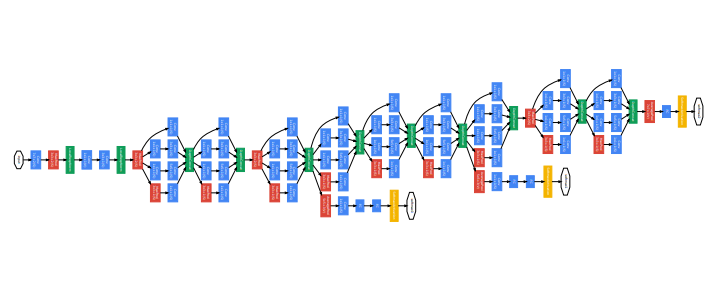

## Materials


[Open notebook in Colab](https://colab.research.google.com/gist/fercer/d4757f8257607cb0748c65714660600b/advanced_machine_learning_with_python_session_2_2.ipynb){.btn .btn-outline-primary .btn role="button" target=”_blank”} [View solutions](https://colab.research.google.com/gist/fercer/d4757f8257607cb0748c65714660600b/advanced_machine_learning_with_python_session_2_2-solved.ipynb){.btn .btn-outline-primary .btn role="button" target=”_blank”}


# Load pre-trained models

---

## Load pre-trained models

* Lets use one from the PyTorch's `torchvision` module for computer vision

* Try first with the InceptionV3 model. 


---

## Exercise: Use a pre-trained deep learning model to classify images {.scrollable}
 
- [ ] Import the pre-trained weights of the Inception V3 model from models.inception_v3

``` {python}
import torch
from torchvision import models

inception_weights = models.inception.Inception_V3_Weights.IMAGENET1K_V1

inception_weights.meta
```

- [ ] Store the categories in a variable to use them later

``` {python}
categories = inception_weights.meta["categories"]
```

::: {.callout-tip}
More info about Inception V3 implementation in `torchvision` [here](https://pytorch.org/vision/main/models/generated/models.inception_v3.html)
:::

---

## Exercise: Use a pre-trained deep learning model to classify images {.scrollable}

- [ ] Load the Inception V3 model using the pre-trained weights `inception_weights`

``` {python}
dl_model = models.inception_v3(inception_weights, progress=True)

dl_model.eval()
```

---

## Exercise: Use a pre-trained deep learning model to classify images {.scrollable}

- [ ] Load a sample image to predict its category

``` {python}
import skimage
import matplotlib.pyplot as plt

sample_im = skimage.data.rocket()
sample_im.shape
```

---

## Exercise: Use a pre-trained deep learning model to classify images {.scrollable}

- [ ] Visualize the sample image

``` {python}
plt.imshow(sample_im)
plt.show()
```

---

## Exercise: Use a pre-trained deep learning model to classify images

- [ ] Inspect what transforms are required by the pre-trained Inception model to work properly

``` {python}
inception_weights.transforms
```

::: {.callout-important}
`functools.partial` is a function to define functions with static arguments. So 👆 returns a function when it is called!
:::

::: {.callout-note}
The transforms used by the Inception V3 are

  1. resize the image to 342x342 pixels,

  2. crop the center 299x299 pixels window, and

  3. normalize the values of the RGB channels.
:::

---

## Exercise: Use a pre-trained deep learning model to classify images

- [ ] Define a preprocessing pipeline using the inception_weights.transforms() method. Add also a transformation from `numpy` arrays into torch tensors.

``` {python}
from torchvision.transforms.v2 import Compose, ToTensor

pipeline = Compose([
  ToTensor(),
  inception_weights.transforms()
])

pipeline
```

---

## Exercise: Use a pre-trained deep learning model to classify images

- [ ] Pre-process the sample image using our pipeline

``` {python}
sample_x = pipeline(sample_im)
type(sample_x), sample_x.shape, sample_x.min(), sample_x.max()
```

---

## Exercise: Use a pre-trained deep learning model to classify images

- [ ] Use the pre-trained model to predict the class of our sample image

::: {.callout-caution}
Apply the model on sample_x[None, ...], so it is treated as a one-sample batch
:::

``` {python}
sample_y = dl_model(sample_x[None, ...])

sample_y.shape
```

---

## Exercise: Use a pre-trained deep learning model to classify images {.scrollable}

::: {.callout-note}
The model's output are the log-probabilities of `sample_x` belonging to each of the 1000 classes.
:::

- [ ] Show the categories with the highest *log-*probabilities.

``` {python}
sample_y.argsort(dim=1)
```

---

## Exercise: Use a pre-trained deep learning model to classify images {.scrollable}

- [ ] Use the list of categories to translate the predicted class index into its category.

``` {python}

sorted_predicted_classes = sample_y.argsort(dim=1, descending=True)[0, :10]
sorted_probs = torch.softmax(sample_y, dim=1)[0, sorted_predicted_classes]

for idx, prob in zip(sorted_predicted_classes, sorted_probs):
    print(categories[idx], "%3.2f %%" % (prob * 100))
```

# Try with other sample images (only works with RGB!)

---

## Try with other sample images {.scrollable}

::: {.callout-caution}
Only works with RGB images
:::

- [ ] Use the pre-trained model to classify images from the internet (try some from the [Kodak Lossless True Color Image Suite](https://r0k.us/graphics/kodak/)).

``` {python}
sample_im = skimage.io.imread("https://r0k.us/graphics/kodak/kodak/kodim21.png")
sample_x = pipeline(sample_im)
sample_y = dl_model(sample_x[None, ...])

plt.imshow(sample_im)
plt.title(categories[sample_y.argmax(dim=1)])
plt.show()

sorted_predicted_classes = sample_y.argsort(dim=1, descending=True)[0, :10]
sorted_probs = torch.softmax(sample_y, dim=1)[0, sorted_predicted_classes]

for idx, prob in zip(sorted_predicted_classes, sorted_probs):
    print(categories[idx], "%3.2f %%" % (prob * 100))
```

- [ ] Try with an image from a category that is not in the labels set of the model (like one with [hanging caps](https://r0k.us/graphics/kodak/kodak/kodim03.png))

# Using Deep Learning models as feature extractors

## Exercise: Modify the classifier layer `dl_model.fc` to return the features map from the input image instead of the category

::: {.callout-tip}
The classifier layer is commonly implemented as a MultiLayer Perceptron (Fully connected) at the end of the models.
The specific name of that layer can vary between implementations.
:::

- [ ] Load the pre-trained Inception V3 model again to use it as feature extractor.

``` {python}
dl_extractor = models.inception_v3(inception_weights, progress=True)
dl_extractor.eval()

dl_extractor.fc
```

---

## Exercise: Modify the classifier layer `dl_model.fc` to return the features map from the input image instead of the category

- [ ] Replace the `.fc` layer with a `torch.nn.Identity` module.

``` {python}
dl_extractor.fc = torch.nn.Identity()
```

- [ ] Use the model for feature extraction in the same way it is used for image classification.

``` {python}
sample_fx = dl_extractor(sample_x[None, ...])

sample_fx.shape
```

---

## Visualize the embedded feature space

- [ ] Use the `dl_extractor` to embed multiple images into a feature space

``` {python}
import skimage
```

### Load some pictures of cats and dogs

``` {python}
#| echo: false

urls = [
    ("https://farm9.staticflickr.com/8313/8018401818_5eecf6b36e_z.jpg", 0),
    ("http://farm5.staticflickr.com/4020/4265373328_3eaacdfcf5_z.jpg", 0),
    ("http://farm9.staticflickr.com/8015/7288852186_fe593d3525_z.jpg", 0),
    ("http://farm1.staticflickr.com/45/139158271_cf94704f69_z.jpg", 0),
    ("http://farm2.staticflickr.com/1157/907815149_5a5b538a3f_z.jpg", 0),
    ("http://farm2.staticflickr.com/1211/1394274046_55c49f99e8_z.jpg", 0),
    ("http://farm5.staticflickr.com/4135/4927652096_1ed515bba8_z.jpg", 0),
    ("http://farm3.staticflickr.com/2139/2257053341_a6aa1c3d78_z.jpg", 0),
    ("http://farm1.staticflickr.com/45/111672925_f6391266f3_z.jpg", 0),
    ("http://farm5.staticflickr.com/4091/5072911098_88004a9f89_z.jpg", 0),
    ("http://farm6.staticflickr.com/5269/5677055129_b35a4304c9_z.jpg", 0),
    ("http://farm5.staticflickr.com/4145/4995782329_030dc61265_z.jpg", 0),
    ("http://farm1.staticflickr.com/136/319420724_38b6202bac_z.jpg", 0),
    ("http://farm4.staticflickr.com/3505/3456722849_a9cd5ae80a_z.jpg", 0),
    ("http://farm4.staticflickr.com/3237/3139637908_909c8cc9a7_z.jpg", 0),
    ("http://farm3.staticflickr.com/2697/4346534546_a042ab4102_z.jpg", 0),
    ("http://farm5.staticflickr.com/4058/4212003802_18c081f719_z.jpg", 0),
    ("http://farm4.staticflickr.com/3716/9121410156_75f1bf93f9_z.jpg", 0),
    ("http://farm1.staticflickr.com/4/7526350_cbc6472a26_z.jpg", 0),
    ("http://farm9.staticflickr.com/8468/8144608869_655919484a_z.jpg", 0),
    ("http://farm2.staticflickr.com/1388/599769277_d769f1572d_z.jpg", 0),
    ("http://farm4.staticflickr.com/3220/2499189702_8a44587f96_z.jpg", 0),
    ("http://farm4.staticflickr.com/3401/3311805393_7c475a4aa9_z.jpg", 0),
    ("http://farm1.staticflickr.com/155/415139495_396082f95c_z.jpg", 0),
    ("http://farm6.staticflickr.com/5462/9423408496_56c541eee9_z.jpg", 0),
    
    ("http://farm3.staticflickr.com/2349/2077139917_59193cd181_z.jpg", 1),
    ("http://farm3.staticflickr.com/2556/4228514131_81f3416db3_z.jpg", 1),
    ("http://farm8.staticflickr.com/7196/6893321249_8a3d461b07_z.jpg", 1),
    ("http://farm6.staticflickr.com/5213/5412019780_eaf631e8bb_z.jpg", 1),
    ("http://farm5.staticflickr.com/4070/4526570335_a82bfc4726_z.jpg", 1),
    ("http://farm1.staticflickr.com/98/261719358_1b536b3392_z.jpg", 1),
    ("http://farm6.staticflickr.com/5059/5443064084_48ccc5cf59_z.jpg", 1),
    ("http://farm3.staticflickr.com/2097/2242166933_ea67502aba_z.jpg", 1),
    ("http://farm4.staticflickr.com/3750/9707700011_54b370d0f8_z.jpg", 1),
    ("http://farm6.staticflickr.com/5106/5670500150_e035dd2d30_z.jpg", 1),
    ("http://farm4.staticflickr.com/3048/3520233384_bae29048c0_z.jpg", 1),
    ("http://farm1.staticflickr.com/23/33555333_33ed196c56_z.jpg", 1),
    ("http://farm1.staticflickr.com/117/299910219_57e7f4ee46_z.jpg", 1),
    ("http://farm4.staticflickr.com/3259/3238050924_c9b36390ac_z.jpg", 1),
    ("http://farm5.staticflickr.com/4091/5152816378_04ee22f16a_z.jpg", 1),
    ("http://farm8.staticflickr.com/7157/6406392847_2cb3203923_z.jpg", 1),
    ("http://farm3.staticflickr.com/2372/2081626754_2bf30168c1_z.jpg", 1),
    ("http://farm4.staticflickr.com/3088/3229242096_64039bf1ce_z.jpg", 1),
    ("http://farm3.staticflickr.com/2561/3806462170_661b518fa7_z.jpg", 1),
    ("http://farm6.staticflickr.com/5215/5499994653_748a7cbcbd_z.jpg", 1),
    ("http://farm4.staticflickr.com/3452/3277828677_9145bc2cee_z.jpg", 1),
    ("http://farm6.staticflickr.com/5023/5623575225_5292f4e154_z.jpg", 1),
    ("http://farm1.staticflickr.com/98/238807701_1db2c72d6c_z.jpg", 1),
    ("http://farm1.staticflickr.com/183/384994285_9c1d297719_z.jpg", 1),
    ("http://farm8.staticflickr.com/7143/6742412997_a26c229184_z.jpg", 1),

    ("http://farm5.staticflickr.com/4125/5008137181_5244f3b199_z.jpg", 2),
    ("http://farm5.staticflickr.com/4009/4377643428_f413224766_z.jpg", 2),
    ("http://farm3.staticflickr.com/2731/4308417350_63019dae36_z.jpg", 2),
    ("http://farm2.staticflickr.com/1342/1342680003_e85c0c76a3_z.jpg", 2),
    ("http://farm1.staticflickr.com/32/56869606_087663131f_z.jpg", 2),
    ("http://farm1.staticflickr.com/34/71018161_4b0933e491_z.jpg", 2),
    ("http://farm5.staticflickr.com/4125/5008137181_5244f3b199_z.jpg", 2),
    ("http://farm4.staticflickr.com/3286/3143017888_b18f27ed58_z.jpg", 2),
    ("http://farm4.staticflickr.com/3790/9386858048_db83b64e1b_z.jpg", 2),
    ("http://farm4.staticflickr.com/3348/3652187987_e243f35e00_z.jpg", 2)
]
```

``` {.python}
urls = [
    ("https://farm9.staticflickr.com/8313/8018401818_5eecf6b36e_z.jpg", 0),
    ...
    ("http://farm4.staticflickr.com/3348/3652187987_e243f35e00_z.jpg", 2)    
]
```

``` {python}
from tqdm.auto import tqdm

ys = []
fxs = []
for x_url, y in tqdm(urls):
    im = skimage.io.imread(x_url)
    x = pipeline(im)

    with torch.no_grad():
        fx = dl_extractor(x[None, ...])

    fxs.append(fx[0, ...])
    ys.append(y)
```

---

## Visualize the embedded feature space

- [ ] Use `PCA` to project the $2048$ dimension feature space into a **2D** space for visualization

``` {python}
import numpy as np
from sklearn.decomposition import PCA

X = np.array(fxs)
Y = np.array(ys)

pca = PCA(n_components=2)
pca.fit(X)
```

---

## Visualize the embedded feature space

- [ ] Use `PCA` to project the $2048$ dimension feature space into a **2D** space for visualization

``` {python}
embedded_X = pca.transform(X)

fig, ax = plt.subplots()

for c_id, (category, m) in enumerate([("Cats", "o"), ("Dogs", "x"), ("Both", "^")]):
    scatter = ax.scatter(x=embedded_X[Y == c_id, 0], y=embedded_X[Y == c_id, 1], marker=m, label=category)

plt.legend()
```
